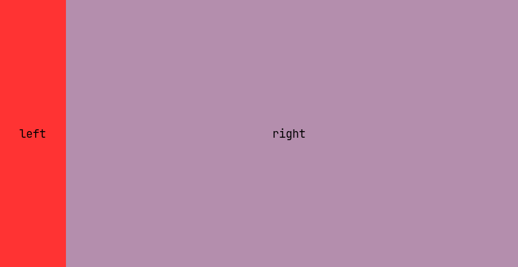

Bubble Layout
=============

Declarative layout manager for [BubbleTea](https://github.com/charmbracelet/bubbletea/).

BubbleLayout provides a powerful API without sacrificing readability. Inspired by [MigLayout](http://miglayout.com/).

## Usage

BubbleLayout uses a declared layout to translate `WindowSizeMsg` events into `BubbleLayoutMsg` events. Individual parts of the UI would handle the `BubbleLayoutMsg` to retrieve their absolute dimensions using a unique ID.

### Layout Declaration

The layout is typically defined during root component initialization. It defines all of the constrains which should be used when sizing different components.

#### **Add** components to the grid
Here is a simple example which with two side-by-side sections. Notice that the second component doesn't define `MaxWidth` and neither component defines `MaxHeight`, BubbleLayout takes this to mean that the singular row should fill the available height and the second component should fill the available width. `MinWidth` and `PreferredWidth` are also available, these are all considered by the layout engine when calculating view dimensions.

```go
layout := bl.New()
leftID := layout.Add(bl.Layout{MaxWidth: 10})
rightID := layout.Add(bl.Layout{})
```


[Simple example code](./examples/simple/main.go)

#### **Span** components across multiple cells
Here is a more complex example. It defines a layout utilizing horizontal and vertical spans, these allow you to define your grid with components that take up multiple cells.

```go
layout := bl.New()
var models []tea.Model
models = append(models, util.NewSimpleModel("9", layout.Add(bl.Layout{})))
models = append(models, util.NewSimpleModel("10", layout.Add(bl.Layout{SpanWidth: 2, SpanHeight: 2})))
models = append(models, util.NewSimpleModel("11", layout.Add(bl.Layout{})))
layout.Wrap()
models = append(models, util.NewSimpleModel("12", layout.Add(bl.Layout{SpanHeight: 2})))
models = append(models, util.NewSimpleModel("13", layout.Add(bl.Layout{})))
layout.Wrap()
models = append(models, util.NewSimpleModel("14", layout.Add(bl.Layout{})))
models = append(models, util.NewSimpleModel("15", layout.Add(bl.Layout{SpanWidth: 2})))
```


[Spans example code](./examples/spans/main.go)

#### **Dock** components for common overrides

Here is an example that has fixed size components at the top and bottom of the layout. Note that if you have multiple overlapping docs, the order that they are defined determines which one is drawn over the corner.

```go
  bl := layout.New()
  var models []tea.Model
  models = append(models, util.NewSimpleModel("9", bl.Add(layout.Layout{})))
  models = append(models, util.NewSimpleModel("10", bl.Add(layout.Layout{})))
  bl.Wrap()
  models = append(models, util.NewSimpleModel("11", bl.Add(layout.Layout{SpanWidth: 2, SpanHeight: 2})))

  models = append(models, util.NewSimpleModel("12", bl.Dock(layout.NORTH, 1, 1, 1)))
  models = append(models, util.NewSimpleModel("13", bl.Dock(layout.SOUTH, 1, 1, 1)))
  models = append(models, util.NewSimpleModel("14", bl.Dock(layout.WEST, 1, 10, 10)))
  models = append(models, util.NewSimpleModel("15", bl.Dock(layout.EAST, 1, 10, 10)))
```


[Docking example code](./examples/docking/main.go)

### Layout model

Somewhere in your program, you'll need to capture the `tea.WindowSizeMsg` and feed it back into BubbleTea as a `BubbleLayoutMsg`.

```go
func (m layoutModel) Update(msg tea.Msg) (tea.Model, tea.Cmd) {
  switch msg := msg.(type) {
  case tea.WindowSizeMsg:
    // Convert WindowSizeMsg to BubbleLayoutMsg.
    return m, func() tea.Msg {
      return m.layout.Resize(msg.Width, msg.Height)
    }
  return m, nil
}
```

### Resizing the view

Each of your views should be initialized with the layout ID emitted from the layout definition. From that point forward, simply listen for the `BubbleLayoutMsg`.

```go
func (m myModel) Update(msg tea.Msg) (tea.Model, tea.Cmd) {
  switch msg := msg.(type) {
  case bl.BubbleLayoutMsg:
    sz, _ := msg.Size(m.id)
    m.width = sz.Width
    m.height = sz.Height
  }

  return m, nil
}
