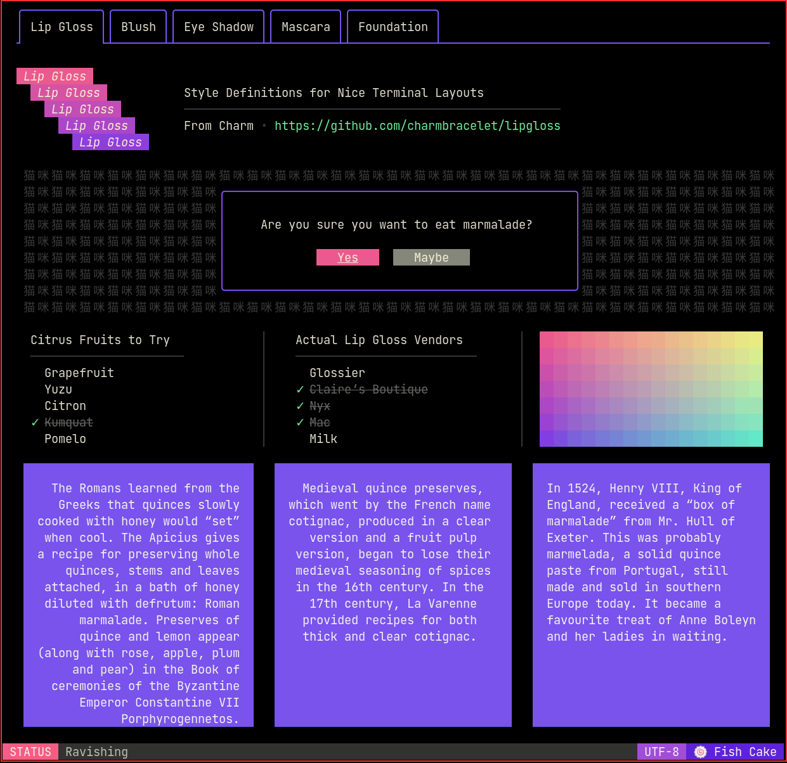

# Lipgloss Example

This directory contains a re-implementation of the lipgloss demo as a fully fledged application leveraging bubble layout for component sizing. The state of each component is entirely decoupled from the application aside from messages sent to the Update functions. Various decorations have been added to most components to visualize state changes.

The example utility layout is used to simplify the main function. It may be desirable to use `examples/util/LayoutModel.go` as a basis for your application but it is not required.

